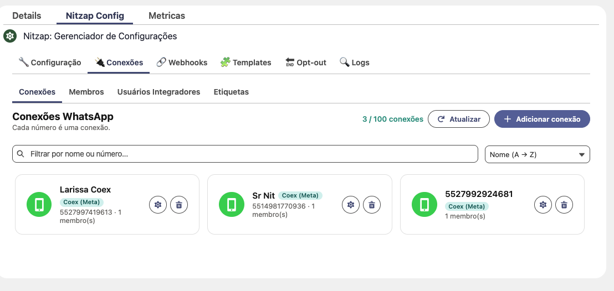
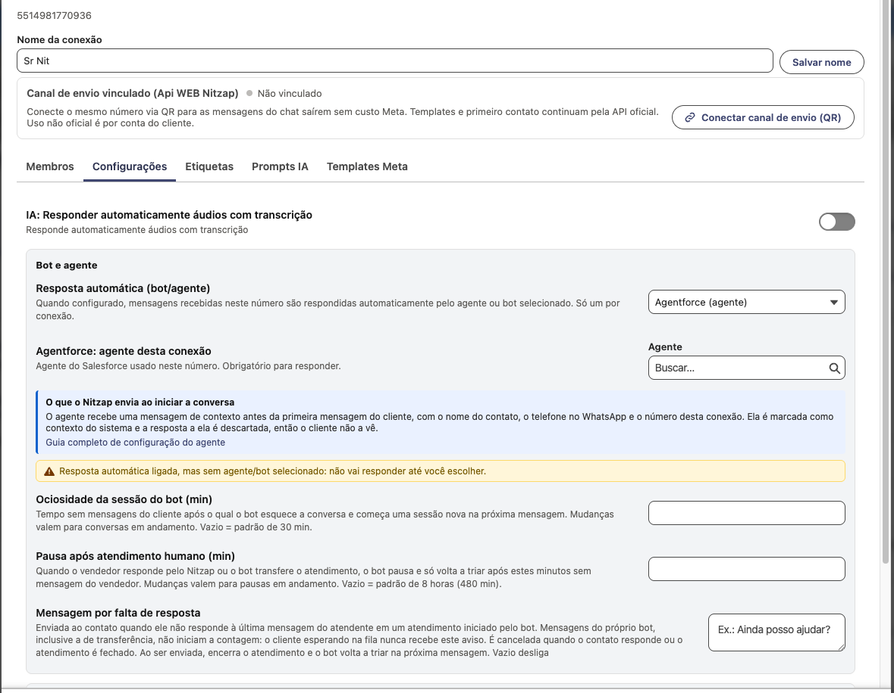

# Configuração do Einstein Bot/AgentForce no Nitzap

Configuração inicial. 
Obs: A configuração abaixo é apenas um Start do requerido para rodar o Bot. Pode ser que ao configurar como abaixo será necessário ainda 
habilitar e desabilitar funções que dependem de cada fluxo de segurança de cada Organização. Para obter consultoria personalizada consulte a Datago.

Para iniciar a configuração deve-se criar um aplicativo conectado externo no Salesforce para realizar a comunicação do Nitzap com o Salesforce
Para isso 
1. clique em Configurações
2. Na busca rápida pesquise por "Gerenciador de aplicativo de cliente externo".
3. Clique em "Novo aplicativo cliente externo"

Na criação Habilite OAuth e selecione os escopos da imagem abaixo


ou contato a Datago para consultoria personalizada.

Entre os escopos, o **"Gerenciar dados do usuário via APIs (api)"** é obrigatório: além de falar com o agente, o Nitzap usa esse aplicativo para chamar a API do próprio pacote no Salesforce, por exemplo para concluir a tarefa de atendimento quando a mensagem por falta de resposta encerra a conversa. Sem esse escopo, o bot funciona, mas o atendimento fica aberto no Salesforce depois do aviso.

Você deve habilitar o fluxo de credencias do cliente


Na parte de Segurança habilite: "Emitir tokens de acesso com base em Token da Web do JSON (JWT) para usuários nomeados".


Clique em criar.

Adicionalmente relaxe os IPS como abaixo (Apenas se sua organização permitir, caso contrário você pode liberar os IPS):

Ou libere IPS do Nitzap
178.156.203.218
178.156.194.8
178.156.205.98
178.156.196.62
178.156.193.203
178.156.140.66

Também deve adicionar o usuário que irá executar em Politicas OAuth


Esse usuário de execução precisa do conjunto de permissões **Nitzap 2.0** (`Nitzap_20`): é com ele que o Nitzap lê e conclui as tarefas de atendimento pela API do pacote.

Se você ainda não configurou um usuário integração na sua organização consulte:

https://help.salesforce.com/s/articleView?id=platform.integration_user.htm&type=5

Ao criar vá em configurações e em Configurações do OAuth > Chave e segredo do consumidor


Copia as chaves e vá em Nitzap COnfig > Configurações


Coloque em Credenciais Salesforce e clique em Salvar Configurações


Confira se em:
"Configurações do OAuth e do OpenID Connect" 
esteja habilitado:
Permitir código de autorização e fluxo de credenciais

# Configurando o Agente/Bot

Em **Nitzap Config › Conexões › Conexões**, escolha a conexão que vai usar o agente. Cada número é uma conexão, e o agente é configurado por conexão: números diferentes podem ter agentes diferentes, ou nenhum.



Só funciona em conexão da **API oficial da Meta**. Conexões por QR Code não respondem com bot.

Clique na engrenagem da conexão e vá na aba **Configurações**. O bloco **Bot e agente** tem tudo o que importa:



| Campo | O que fazer |
|---|---|
| **Resposta automática (bot/agente)** | Escolha `Agentforce (agente)` ou `Einstein Bot`. Só um por conexão |
| **Agentforce: agente desta conexão** | Busque e selecione o agente do Salesforce. **Obrigatório**: com a resposta automática ligada e sem agente escolhido, aparece o aviso amarelo e nada é respondido |
| **Ociosidade da sessão do bot (min)** | Tempo sem mensagem do cliente após o qual o agente esquece a conversa e começa uma sessão nova. Vazio usa 30 minutos |
| **Pausa após atendimento humano (min)** | Quando o agente transfere o atendimento ou o vendedor responde pelo Nitzap, o agente para de triar e só volta depois desses minutos sem mensagem do vendedor. Vazio usa 8 horas. **É este campo que controla quanto tempo o cliente pode esperar na fila sem o agente reassumir a conversa** |
| **Mensagem por falta de resposta** | Texto enviado ao contato quando ele não responde à última mensagem do atendente. Mensagens do próprio agente, inclusive a de transferência, não iniciam a contagem, então quem está esperando na fila nunca recebe este aviso. Vazio desliga |
| **Tempo sem resposta (min)** | Quanto esperar antes de enviar a mensagem acima. Precisa ser menor que 24 horas, senão o WhatsApp não entrega |

Pronto. A partir daí, mensagem recebida nesse número é respondida pelo agente.

# O que o Nitzap envia para o bot

O Nitzap manda os dados do contato no começo da conversa, uma única vez por sessão. O que muda é a forma, conforme o tipo escolhido.

## Einstein Bot: variáveis

Ao abrir a sessão, o Nitzap envia estas variáveis. Crie cada uma no seu bot, do tipo texto e com exatamente o mesmo nome:

| Variável | Conteúdo |
|---|---|
| `nitzap_contact_phone` | Telefone do contato no WhatsApp |
| `nitzap_contact_name` | Nome que o contato usa no WhatsApp |
| `nitzap_connection_number` | Número da conexão que recebeu a mensagem |

Variável sem valor não é enviada. Por exemplo, um contato sem nome no WhatsApp chega só com telefone e número da conexão.

## Agentforce: mensagem de contexto

O Agentforce não recebe variáveis. Em vez disso, logo depois de abrir a sessão e antes da primeira mensagem do cliente, o Nitzap envia uma mensagem de contexto com os mesmos três dados: nome do contato, telefone no WhatsApp e número da conexão. Ela começa avisando que é contexto do sistema e que não deve ser respondida, e a resposta do agente a ela é descartada, então o cliente nunca a vê.

Uma sessão nova começa quando o contato fala pela primeira vez, quando a sessão anterior fica ociosa pelo tempo configurado na conexão, ou quando o atendimento é fechado no Nitzap. A cada sessão nova o contexto é enviado de novo.

# Encerrando o atendimento automaticamente

Quando a **mensagem por falta de resposta** é enviada, o Nitzap entende que a conversa acabou e faz três coisas, nesta ordem:

1. Encerra a sessão do agente e libera o número, para que a próxima mensagem do cliente comece uma conversa nova em vez de cair na fila antiga.
2. Envia a mensagem ao contato.
3. Avisa o Salesforce: a `Task` do atendimento é concluída, o Omni é atualizado e fica registrado no chat o aviso interno "Atendimento encerrado por inatividade do contato", visível só para os atendentes.

O passo 3 é o que fecha a janela do atendimento no Salesforce, e é o único que depende de configuração da sua organização. Ele usa o **mesmo aplicativo conectado** do agente, chamando a API do próprio pacote Nitzap. Não há nada para preencher no Nitzap: se as permissões abaixo estiverem corretas, funciona sozinho.

Para reagir a esse fechamento, por exemplo encerrar o Caso vinculado ou disparar uma pesquisa de satisfação, crie um Flow disparado pela `Task` quando `nitzap20__Date_Time_End_Chat__c` for preenchido.

## Permissões que só você pode liberar

O usuário que o aplicativo conectado usa para executar precisa conseguir chamar a API do pacote. Isso é concedido dentro da sua organização, e nem a Datago nem o pacote conseguem fazer por você.

**Se o usuário de execução tem licença Salesforce comum:** atribua a ele o conjunto de permissões **Nitzap 2.0**, que já vem no pacote. É só isso.

**Se o usuário de execução tem licença Salesforce Integration**, que é o padrão recomendado pela Salesforce para integrações:

1. O conjunto **Nitzap 2.0** não pode ser atribuído a essa licença, porque inclui acesso a uma página Visualforce que a licença não aceita. A org recusa a atribuição com a mensagem "A licença do usuário não permite Acesso à página do Visualforce".
2. Crie um conjunto de permissões próprio, por exemplo "Nitzap: Integração", com **apenas** o acesso à classe Apex **`NitzapServiceDeskRest`** do pacote, e atribua ao usuário. Nenhuma permissão de objeto, de campo ou licença adicional é necessária: o pacote grava o fechamento em contexto de sistema.

Além disso, no aplicativo conectado, o escopo **"Gerenciar dados do usuário via APIs (api)"** precisa estar marcado. Sem ele o agente continua respondendo, mas o atendimento não é concluído no Salesforce.

## Como saber se está funcionando

Depois de um atendimento encerrado por falta de resposta, confira na `Task` do atendimento:

- **Status** concluído e **Data/Hora de fim do chat** preenchida.
- No chat, o aviso interno "Atendimento encerrado por inatividade do contato".

Se a `Task` continuar aberta, a causa quase sempre é permissão. Em **Configuração › Trabalhos do Apex** e nos logs do aplicativo conectado você vê o erro; os mais comuns são:

| Mensagem | O que fazer |
|---|---|
| `You do not have access to the Apex class named: NitzapServiceDeskRest` | Falta o conjunto de permissões com acesso à classe no usuário de execução |
| `INSUFFICIENT_ACCESS_ON_CROSS_REFERENCE_ENTITY` | Pacote desatualizado: atualize para a versão que grava o fechamento em contexto de sistema |
| Nada acontece e o agente segue respondendo | Falta o escopo `api` no aplicativo conectado, ou as credenciais não estão salvas em Nitzap Config › Configurações › Credenciais Salesforce |

# O bot controlando o atendimento pelo Apex

O agente pode abrir, transferir e encerrar o atendimento chamando o Nitzap direto do Apex, de um Flow ou de uma ação invocável. Os três métodos fazem exatamente o que os botões do chat fazem: mexem na `Task`, avisam o Omni de todo mundo na hora e gravam no chat o aviso interno que só os atendentes veem.

Todos recebem o **Id da Task do atendimento**, nunca o do contato nem o da conversa, e podem ser chamados depois de gravar registros na mesma transação.

## Abrir o atendimento

`createServiceDesk` monta a `Task` no formato certo, não duplica atendimento aberto para o mesmo contato na mesma conexão, avisa o Omni e registra "iniciou o atendimento" com o link da tarefa:

```apex
nitzap20.NitzapApi.NewServiceDesk novo = new nitzap20.NitzapApi.NewServiceDesk();
novo.whoId = contato.Id;                  // contato ou lead; use whatId para Caso ou Oportunidade
novo.ownerId = filaComercial.Id;          // usuário ou fila; em branco fica com quem executa
novo.connectionNumber = '5514981770936';  // conexão que recebeu a mensagem
novo.subject = 'Atendimento via bot';     // opcional

nitzap20.NitzapApi.ServiceDeskCreation atendimento = nitzap20.NitzapApi.createServiceDesk(novo);
```

O retorno traz `taskId`, a tarefa do atendimento, e `created`, que vem `false` quando já existia atendimento aberto e nenhum outro foi criado.

Dono usuário abre o atendimento direto para ele; dono fila coloca a conversa na fila para alguém puxar.

## Transferir o atendimento

`transferServiceDesk` troca o responsável, respeita a opção "Fechar tarefa ao transferir" das configurações do app, notifica o novo responsável e registra "transferiu o atendimento de A para B":

```apex
nitzap20.NitzapApi.ServiceDeskTransfer movido =
    nitzap20.NitzapApi.transferServiceDesk(atendimento.Id, filaComercial.Id);   // usuário ou fila
```

O retorno diz qual `Task` segue como atendimento, útil quando a opção de fechar ao transferir cria uma nova.

## Encerrar o atendimento

`closeServiceDesk` conclui a `Task`, avisa o Omni, encerra a sessão do agente e, só depois disso, envia a mensagem de despedida ao contato:

```apex
nitzap20.NitzapApi.closeServiceDesk(
    atendimento.Id,
    'Nossa conversa foi encerrada. Qualquer problema pode me chamar por aqui novamente.'
);
```

A despedida é opcional: passando em branco, o atendimento encerra sem enviar nada.

**Não envie a despedida por conta própria em paralelo.** Se ela sair antes de o Nitzap encerrar a sessão do agente, conta como mensagem de atendimento e reinicia a contagem da mensagem por falta de resposta, e o cliente recebe "conversa encerrada por inatividade" minutos depois de já ter sido despedido. Deixando o texto no `closeServiceDesk`, a ordem fica garantida.

Os três métodos estão detalhados, com todas as regras e mensagens de erro, nas seções 14 a 16 de:
https://github.com/DataGo-Dev/datago-public/blob/main/docs/apex_usage.md

# Alternativa: criar a tarefa por conta própria

Se o seu bot já cria ou atualiza a `Task` do atendimento do jeito dele, use `notifyServiceDeskChangeAsync` para avisar o Nitzap depois. Sem isso, a conversa só aparece como atendida no Omni de quem recarregar a tela.

```apex
nitzap20.NitzapApi.notifyServiceDeskChangeAsync(atendimento.Id);
```

A ação é deduzida do estado da própria tarefa: dona usuário abre atendimento, dona fila manda para a fila e tarefa encerrada fecha o atendimento.

Nesse caminho, três campos precisam estar preenchidos na criação para o Nitzap reconhecer a tarefa e conseguir ler a conversa dentro dela:

| Campo | Valor | Por quê |
|---|---|---|
| `nitzap20__TaskType__c` | `SERVICE_DESK` | É o que marca a tarefa como atendimento. Sem isso o Nitzap não a trata como atendimento e `notifyServiceDeskChange` lança erro |
| `nitzap20__Connection_Number__c` | número da conexão que recebeu a mensagem | Diz de qual conexão é o atendimento. É por ele que o aviso chega no Omni certo e que o chat sabe qual número usar |
| `nitzap20__Date_Time_Start_Chat__c` | momento em que o atendimento começou | Marca o início do histórico. É a partir dessa data que o Nitzap lê as mensagens da conversa dentro da tarefa; em branco, a tarefa abre sem histórico |

Os detalhes desse caminho estão na seção 13 de:
https://github.com/DataGo-Dev/datago-public/blob/main/docs/apex_usage.md

Esse mesmo guia traz tudo o que o bot pode fazer pelo Apex: enviar mensagens e templates, ler conversas, consultar métricas e encontrar o registro de um telefone.

Para quaisquer dúvidas entre em contato com a Datago +55 27 99997-0276

- João


