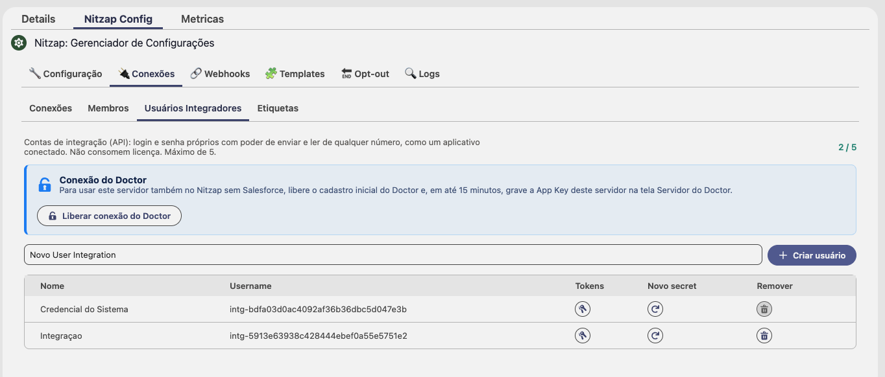
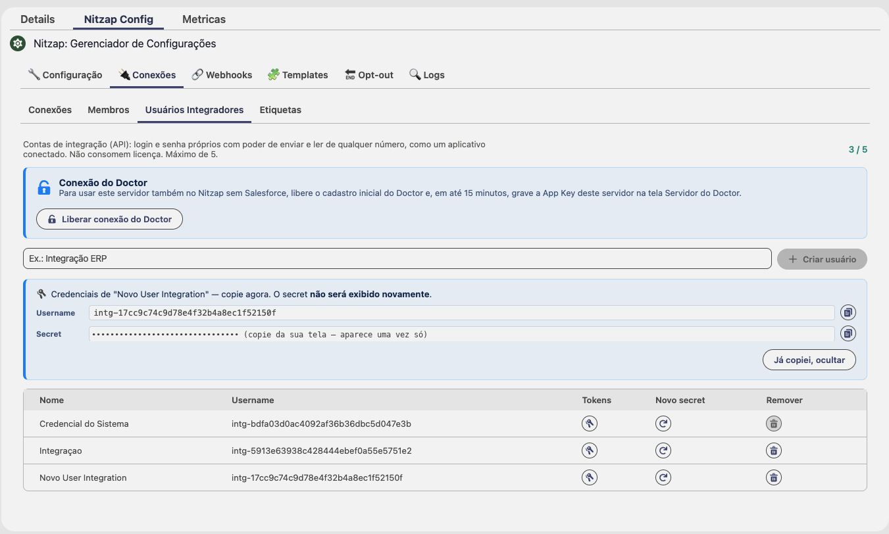

# Usuário integrador: usando a API do Nitzap no Postman

O usuário integrador é a credencial do seu sistema na API do Nitzap. Com ele, o seu ERP, site ou automação envia e lê mensagens por qualquer número de WhatsApp conectado à organização, sem depender do login de uma pessoa. Este guia mostra como criar a credencial e fazer as primeiras chamadas pela collection do Postman.

## O que é o usuário integrador

- Tem **login e secret próprios**, como um aplicativo conectado.
- Envia e lê por **qualquer conexão** (número de WhatsApp) da organização, sem precisar estar vinculado a ela.
- **Não consome licença.**
- Cada organização pode ter **até 5**.

Use o usuário integrador quando quem chama a API é um **sistema**. Para uma pessoa operando o WhatsApp, use o login do próprio usuário: ele só alcança os números a que a pessoa tem acesso.

## 1. Criar a credencial

Aba **Nitzap Config → 🔌 Conexões → Usuários Integradores**, dentro do Gerenciador de Configurações do Nitzap. Só **administradores** do Nitzap veem esta tela.



1. Digite um nome que diga quem vai usar a credencial (ex.: `Integração ERP`).
2. Clique em **Criar usuário**.
3. Aparecem o **Username** (começa com `intg-`) e o **Secret**. Copie os dois pelos botões ao lado e guarde num cofre de senhas.
4. Clique em **Já copiei, ocultar**.



> ⚠️ **O secret só aparece uma vez.** Fechou a tela sem copiar? Use **Novo secret** na linha do usuário para gerar outro.

Algumas regras para evitar dor de cabeça:

- **Não use a "Credencial do Sistema".** É a credencial que o próprio Nitzap usa nas configurações. Ela não pode ser removida, e trocar o secret dela pela tela é feito para o Nitzap, não para a sua integração.
- **Crie uma credencial por sistema** (ERP, site, BI). Se um deles vazar ou for desligado, você troca só aquele sem derrubar os outros.

Os botões de cada linha:

| Botão | O que faz |
| --- | --- |
| **Tokens** | Gera tokens de longa duração para servidores (seção 7). |
| **Novo secret** | Gera um secret novo. **O antigo para de funcionar na hora**: atualize todo sistema que usa esta credencial. |
| **Remover** | Apaga o usuário integrador. Antes de remover, **revogue os tokens dele** no painel **Tokens**. |

## 2. Preparar o Postman

### Importar a collection

No Postman, clique em **Import** e arraste o arquivo da collection **Nitzap - Api Usage** enviado pela Datago.

### Preencher as variáveis

Clique na collection **Nitzap - Api Usage**, aba **Variables**, e preencha a coluna **Current value**:

| Variável | O que colocar |
| --- | --- |
| `base_url` | O endereço do seu servidor Nitzap, sem barra no fim (ex.: `https://suaempresa.nitzap.com`). Está em **Nitzap Config → Configuração → Servidor Nitzap → URL Base**. |
| `username` | O **Username** do usuário integrador (`intg-...`). |
| `password` | O **Secret** do usuário integrador. |
| `jwt_token` | Deixe vazio. O login preenche sozinho. |
| `app_key` | Deixe vazio. O usuário integrador não precisa dela. |

Salve a collection (**Ctrl+S** / **Cmd+S**).

> Use a coluna **Current value**, não **Initial value**. O valor inicial vai junto quando alguém exporta ou compartilha a collection; o atual fica só no seu Postman.

## 3. Fazer login

Abra **01 - Auth / Login → Login** e clique em **Send**. O corpo já usa as variáveis:

```json
{
  "username": "{{username}}",
  "password": "{{password}}"
}
```

Resposta:

```json
{
  "success": true,
  "sessionToken": "eyJhbGciOiJIUzI1NiIsInR5cCI6...",
  "expiresIn": 3600,
  "expiresAt": "2026-10-01T15:30:00Z"
}
```

A collection já guarda o `sessionToken` na variável `jwt_token`, e todas as outras requisições mandam o cabeçalho `Authorization: Bearer {{jwt_token}}`. Você não precisa copiar nada.

O token vale **1 hora**. Quando as chamadas começarem a responder `401`, rode o **Login** de novo.

## 4. Descobrir os números das conexões

Toda chamada do usuário integrador precisa dizer **por qual número** ela age. Esse número é o `vFrom`, e você descobre os disponíveis em `GET /whatsapp/sessions`.

Essa requisição não vem pronta na collection. Para criar:

1. Na pasta **07 - WhatsApp (JWT) → Check / me**, clique com o botão direito em **Me** e escolha **Duplicate**.
2. Renomeie para **Sessions**.
3. Troque a URL para `{{base_url}}/whatsapp/sessions` e clique em **Send**.

```json
[
  { "sessionId": "da8129fd-d9b1-49cd-a39d-3e9407bc9406", "name": "Comercial", "number": "5527988887777" },
  { "sessionId": "1788007f-48ee-47d2-a6d9-639905c2dbf0", "name": "Suporte", "number": "5527966665555" }
]
```

O `number` de cada item é exatamente o que vai no `vFrom`.

> O **Me** (`GET /whatsapp/me`) volta com `"connections": []` para o usuário integrador. É esperado: ele não está vinculado a nenhum número. Use o **Sessions**.

## 5. O `vFrom`: a regra que mais derruba integração

O usuário integrador não tem número próprio, então **toda** chamada precisa do `vFrom`. O lugar onde ele vai muda conforme a rota:

| Rotas | Onde vai o `vFrom` |
| --- | --- |
| `send-message`, `enque-multiples` | no corpo: `"vFrom": "5527988887777"` |
| `get-messages`, `get-range-messages`, `search-messages`, `get-media` | no corpo, dentro de `vOverride`: `"vOverride": { "vFrom": "5527988887777" }` |
| Rotas `GET` (`mycontacts`, `check-number`, `get-chat-metadata`…) e as de templates em `/waba` | na URL: `?vFrom=5527988887777` |

Os exemplos da collection usam `5511888888888` como número da conexão e `5511999999999` como contato. **Troque pelos seus** antes de enviar.

> ⚠️ **Na leitura, esquecer o `vFrom` não dá erro.** A resposta vem `200` com uma lista vazia `[]`. Se uma conversa que você sabe que existe voltou vazia, confira o `vFrom` primeiro.

Números sempre com DDI e DDD, só dígitos, sem `+` e sem espaços: `5527999998888`.

## 6. Primeiros testes

### Enviar uma mensagem de texto

**07 - WhatsApp (JWT) → Envio (scope: send) → Send message**

```json
{
  "vFrom": "5527988887777",
  "to": "5527999998888",
  "type": "text",
  "message": "Olá! Primeira mensagem pela API do Nitzap."
}
```

```json
{ "success": true, "id": "b666a5ba-aaea-414e-944c-8f51c376f171", "msgKey": "3EB0C2F1A9D4E5B7C8" }
```

> ⚠️ **Conexões da API oficial (WABA) seguem a janela de 24 horas da Meta.** Mensagem livre só é aceita até 24h depois da última mensagem do contato. Para iniciar conversa, ou fora dessa janela, use um template (mais abaixo). Conexões por QR Code não têm essa regra.

### Enviar um arquivo

A mesma requisição envia imagem, documento, vídeo e áudio. Muda o `type` e entra o objeto `media`:

```json
{
  "vFrom": "5527988887777",
  "to": "5527999998888",
  "type": "document",
  "message": "Segue o orçamento solicitado.",
  "media": {
    "url": "https://seu-sistema.com/arquivos/orcamento-12345.pdf",
    "mimetype": "application/pdf",
    "filename": "Orcamento-12345.pdf"
  }
}
```

- O `media.url` precisa abrir **sem login**: o Nitzap baixa o arquivo dessa URL. Link interno, de intranet ou que pede senha faz o envio falhar.
- Não existe envio em base64: a URL é o único jeito de anexar.
- `type`: `image` (JPEG, PNG ou GIF), `document` (qualquer arquivo; mande o `filename` com extensão), `video` (MP4) ou `audio` (MP3, WAV, M4A, OGG; chega como mensagem de voz).

**Não tem onde hospedar o arquivo?** Use o espaço do Nitzap, pela pasta **S3 (mídia)** da collection:

1. **S3 generate presigned URL** com `{ "key": "documentos/orcamento-12345.pdf", "mimetype": "application/pdf" }`. A resposta traz `url` (para subir) e `get_url` (para enviar).
2. Crie uma requisição **PUT** para o `url` da resposta, em até 15 minutos. Em **Body**, escolha **binary** e selecione o arquivo. Em **Headers**, só `Content-Type` com o mesmo `mimetype` do passo 1, **sem** `Authorization`.
3. Com o PUT respondendo `200`, faça o **Send message** com o `get_url` no `media.url`.

### Ler uma conversa

**07 - WhatsApp (JWT) → Leitura de mensagens (scope: read) → Get messages**

Na primeira chamada, **apague o `sequence` e o `follow`** do exemplo para começar pelas mensagens mais recentes:

```json
{
  "target": "5527999998888",
  "vOverride": { "vFrom": "5527988887777" },
  "take": 30
}
```

A resposta é uma lista de mensagens, das mais novas para as mais antigas. Para buscar a página anterior, pegue o **menor** `sequence` da página e mande de volta **como texto**, com `follow: "lt"`:

```json
{
  "target": "5527999998888",
  "vOverride": { "vFrom": "5527988887777" },
  "take": 30,
  "sequence": "1783966686472",
  "follow": "lt"
}
```

> O `sequence` vai **entre aspas**. Mandado como número, a paginação repete sempre a primeira página.

Em mensagens com mídia, o campo `url` é um link temporário (vale cerca de 2 horas). Não guarde esse link: guarde o `id` da mensagem e leia de novo quando precisar do arquivo.

### Enviar um template (só conexões WABA)

Primeiro veja os templates aprovados em **17 - WABA (WhatsApp Cloud) → Autenticado (JWT) → Get templates** (`?vFrom=` na URL). Só os de `status: "APPROVED"` podem ser enviados.

Depois use **Send template**, com o `vFrom` na URL. **Troque o corpo do exemplo por este formato**, que é o objeto de template da Meta dentro de `payload`:

```json
{
  "payload": {
    "messaging_product": "whatsapp",
    "recipient_type": "individual",
    "to": "5527999998888",
    "type": "template",
    "template": {
      "name": "nps_teste_2",
      "language": { "code": "pt_BR" },
      "components": [
        {
          "type": "body",
          "parameters": [ { "type": "text", "text": "João" } ]
        }
      ]
    }
  }
}
```

Cada `{{1}}`, `{{2}}`… do template vira um item de `parameters`, na ordem. Botões, cabeçalho com imagem e demais componentes seguem a [documentação de templates da Meta](https://developers.facebook.com/docs/graph-api/reference/page/message_templates/).

### Receber mensagens em tempo real (webhook)

Para o seu sistema ser avisado de cada mensagem, cadastre um webhook. Pela tela, siga o guia [Webhooks do Nitzap](webhooks.md). Pela API, o usuário integrador também pode: **13 - Webhook (JWT) → Post webhook**, com este corpo:

```json
{
  "name": "ERP Produção",
  "url": "https://seu-sistema.com/nitzap/webhook",
  "secret": "um-texto-que-voce-inventa",
  "isactive": true,
  "events": ["ON_MESSAGE", "ON_ERROR"],
  "tracked_users": ["ALL"]
}
```

- `events` usa os nomes da lista **Allowed events** (`ON_MESSAGE`, `ON_ERROR`, `MESSAGE_UPDATE`…).
- `tracked_users` com `["ALL"]` recebe de todas as conexões. **Lista vazia não recebe nada.**
- A `url` precisa ser `https`.

## 7. Token de longa duração (para servidores)

O token do login vale 1 hora. Para um servidor rodando o tempo todo, gere um **token de longa duração** e evite guardar o secret no servidor.

Na tela **Usuários Integradores**, clique em **Tokens** na linha do usuário e preencha:

| Campo | O que escolher |
| --- | --- |
| **Nome do token** | Onde ele vai ser usado (ex.: `servidor-erp-producao`). |
| **Permissões** | Marque só o necessário (tabela abaixo). |
| **Conexões** | Marque os números que o token pode usar. **Nenhuma marcada = todas**, inclusive as conectadas depois. |
| **Nunca expira** / **Validade (dias)** | Sem marcar, o token vale os dias informados (padrão 30). Marcado, vale até ser revogado. |

| Permissão | Libera |
| --- | --- |
| `read` | Ler mensagens, conversas e contatos |
| `send` | Enviar mensagens e reações |
| `manage` | Editar, apagar e revogar mensagens |
| `connection` | Gerir templates, configurações e prompts da conexão |

Clique em **Gerar token** e copie: **ele também só aparece uma vez**.

**No Postman**, cole o token no **Current value** de `jwt_token` e **não rode o Login** enquanto estiver testando com ele, porque o login sobrescreve a variável.

O que muda com esse token:

- Chamada fora das permissões responde `403 token delegado sem scope necessário`.
- Número fora das conexões marcadas responde `número X não autorizado para este token`.
- Se o token alcança mais de um número, o `vFrom` é obrigatório também no envio.
- O **Sessions** lista só as conexões liberadas para o token.

No mesmo painel ficam os tokens já gerados, com **Último uso** e o botão **Revogar**. A revogação vale na hora.

## 8. Erros comuns

| Resposta | Causa | O que fazer |
| --- | --- | --- |
| `401` em qualquer chamada | Token vencido (1h) ou não enviado | Rode o **Login** de novo. |
| `401` no Login | Username ou secret errado, ou secret trocado em **Novo secret** | Confira as variáveis `username` e `password`. |
| `[]` ao ler uma conversa que existe | Faltou o `vFrom` | Mande `"vOverride": { "vFrom": "..." }` no corpo. |
| `"connections": []` no **Me** | Esperado para o usuário integrador | Use o **Sessions** (seção 4). |
| `[]` em **My chats metadata** | Essa listagem é das conexões de uma pessoa; o integrador não tem nenhuma | Receba as conversas pelo webhook `ON_MESSAGE`. |
| `número X não autorizado para este token` | O token de longa duração não inclui esse número | Use outro `vFrom` ou gere um token com o número. |
| `vFrom é obrigatório` | O token alcança mais de um número | Mande o `vFrom`. |
| `403 token delegado sem scope necessário` | O token não tem a permissão da rota | Gere outro token com a permissão certa. |
| `canal não suportado` em `/waba` | A conexão não é da API oficial | Templates só funcionam em conexões WABA. |
| `success: false` com `falha ao baixar a mídia` | O `media.url` pede login ou não existe | Use um link público ou o espaço S3 do Nitzap. |
| `evento inválido` ao cadastrar webhook | Nome de evento fora da lista | Use os nomes de **Allowed events** (`ON_MESSAGE`…). |

## Resumo

1. Crie o usuário em **Nitzap Config → Conexões → Usuários Integradores** e guarde username e secret.
2. Na collection, preencha `base_url`, `username` e `password` e rode o **Login**.
3. Descubra os números com **Sessions** (`GET /whatsapp/sessions`).
4. Mande o `vFrom` em **toda** chamada.
5. Para servidor, gere um token em **Tokens** no lugar do login.
