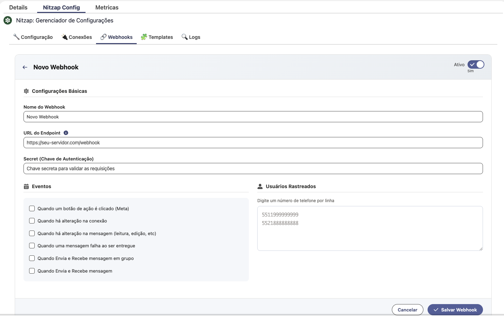

# Webhooks do Nitzap

O webhook avisa o seu sistema, em tempo real, cada vez que algo acontece no WhatsApp conectado ao Nitzap. A cada evento marcado, o Nitzap faz um POST em JSON para a URL que você cadastrar.

Se você só quer ler mensagens dentro do Salesforce, não precisa de webhook — ele existe para levar os eventos para fora: ERP, site, automação, integração própria.

## Onde configurar

Aba **Nitzap Config → 🔗 Webhooks**, dentro do Gerenciador de Configurações do Nitzap.

- Só **administradores** do Nitzap conseguem criar, editar ou excluir webhooks.
- A **App Key** precisa estar salva na aba Configuração; sem ela a aba fica bloqueada.
- Os webhooks valem para a organização inteira, não para um usuário só.



## Campo a campo

### Ativo

Liga e desliga o webhook sem perder a configuração. Desativado, ele continua na lista mas não recebe nenhuma chamada. Use para pausar durante uma manutenção do seu servidor.

### Nome do Webhook

Serve só para você identificar a integração na lista (ex.: `ERP Produção`, `Painel BI`). Não é enviado para o seu servidor.

### URL do Endpoint

O endereço que vai receber o POST.

- Precisa ser **https**. Endereço `http` é recusado no momento de salvar.
- Precisa estar acessível pela internet (não adianta `localhost` nem IP de rede interna).
- Precisa responder com status **2xx**. Qualquer outra coisa conta como falha.

### Secret (Chave de Autenticação)

Um texto livre que você inventa. Ele vai no cabeçalho `Authorization` de toda requisição, exatamente como foi digitado (sem `Bearer`, sem assinatura).

O seu servidor deve comparar esse cabeçalho com o valor esperado e recusar o que não bater — é o que impede alguém de descobrir a sua URL e mandar eventos falsos.

### Eventos

Marque o que o seu servidor precisa receber. **Sem nenhum evento marcado, nada é enviado.**

| Evento na tela | Chave no JSON | Quando dispara |
| --- | --- | --- |
| Quando Envia e Recebe mensagem | `ON_MESSAGE` | Toda mensagem individual, enviada ou recebida (texto, mídia, áudio, documento, localização, contato). |
| Quando Envia e Recebe mensagem em grupo | `ON_GROUP_MESSAGE` | Mesma coisa, só que em conversas de grupo. |
| Quando há alteração na mensagem (leitura, edição, etc) | `MESSAGE_UPDATE` | Mensagem que já existe e mudou: lida, editada ou apagada. O campo `update_type` (ou `isedited`/`isdeleted`) diz qual foi. |
| Quando uma mensagem falha ao ser entregue | `ON_ERROR` | Mensagem recusada ou não entregue no canal oficial (Meta). O motivo vem em `error`. |
| Quando um botão de ação é clicado (Meta) | `BUTTON_CLICK` | Clique em botão de template ou resposta de Flow, no canal oficial. |
| Quando há alteração na conexão | `CONNECTION_UPDATE` | Reservado para mudança de status da conexão (conectou, caiu). **Ainda não gera chamada** — marcar não quebra nada, só não chega nada por enquanto. |

### Usuários Rastreados

Este é o campo que mais confunde: os números aqui são os **números das conexões do Nitzap** (a linha de WhatsApp conectada), **não** os números dos contatos que conversam com você.

- Um número por linha, só dígitos, com DDI e DDD: `5511999999999`.
- **Digite `ALL` para receber os eventos de todas as conexões da organização** — inclusive as que forem conectadas depois. É o jeito mais simples de não esquecer nenhuma linha.
- **Lista vazia não recebe nada.** Cadastrar o webhook e deixar este campo em branco é o motivo mais comum de "configurei e não chega nada".
- `ALL` não diferencia maiúscula de minúscula, e pode ser a única linha do campo.
- O valor comparado é o `username` do envelope (veja abaixo), sempre só dígitos — se a sua conexão é `5527997419613`, é isso que vai na lista.

## O envelope: o que chega na sua URL

```
POST https://seu-servidor.com/webhook
Content-Type: application/json
Authorization: <o secret que você cadastrou>
```

Todo evento chega no mesmo envelope de três campos:

```json
{
  "username": "5527997419613",
  "event_type": "ON_MESSAGE",
  "payload": { }
}
```

| Campo | O que é |
| --- | --- |
| `username` | Número da **conexão** que gerou o evento. É este valor que o campo Usuários Rastreados filtra. |
| `event_type` | A chave do evento (`ON_MESSAGE`, `MESSAGE_UPDATE`, `BUTTON_CLICK`, `ON_ERROR`…). |
| `payload` | O conteúdo do evento. Nos eventos de mensagem é a própria mensagem, com os campos variando conforme o tipo. |

### Entrega e novas tentativas

- Tempo limite de **15 segundos** por tentativa.
- Até **3 tentativas**, com espera de 1s, 2s e 4s entre elas.
- Só status **2xx** encerra a entrega; depois da terceira falha o evento é descartado (fica registrado no log do Nitzap).
- Responda rápido, com `200`, e processe depois. Se o seu endpoint demorar, o Nitzap vai reenviar o mesmo evento — trate repetição usando o `msgkey` como chave de idempotência.
- A ordem de chegada **não é garantida**: dois eventos quase simultâneos podem chegar trocados. Use `message_timestamp` / `sequence` para ordenar.

---

## `ON_MESSAGE` — exemplos por tipo de mensagem

Os exemplos abaixo usam a conexão `5527997419613` conversando com o contato `5527997019622`.

### Texto recebido

```json
{
  "username": "5527997419613",
  "event_type": "ON_MESSAGE",
  "payload": {
    "id": "b666a5ba-aaea-414e-944c-8f51c376f171",
    "msgkey": "3BEF1DC2B825AA1EAA67",
    "sender": "5527997019622",
    "participant": "5527997019622@s.whatsapp.net",
    "reciver": "5527997419613",
    "type": "text",
    "text": "Bom dia, consegue me passar o orçamento?",
    "mimetype": null,
    "url": null,
    "datemsg": "2026-09-24T15:18:06-03:00",
    "pushname": "Maria Souza",
    "isent": false,
    "sessionid": "da8129fd-d9b1-49cd-a39d-3e9407bc9406",
    "chatid": "5527997419613_5527997019622",
    "sequence": 1783966686472,
    "message_timestamp": 1783966686000,
    "mywhatsid": "5527997419613@s.whatsapp.net",
    "secondwhatsappid": "5527997019622@s.whatsapp.net",
    "isgroup": false,
    "channel": "NITZAP"
  }
}
```

> `sender` pode vir como um identificador `@lid` (ex.: `21135550840847`) em vez do telefone, quando o contato usa o modo de privacidade novo do WhatsApp. O `chatid` continua no formato `<suaConexão>_<númeroDoContato>`, e é ele que você deve usar para agrupar a conversa.

### Texto enviado pela sua conexão

Toda mensagem que **sai** também gera `ON_MESSAGE`, com `isent: true`. Se você só quer tratar o que o cliente mandou, filtre por `isent`.

```json
{
  "username": "5527997419613",
  "event_type": "ON_MESSAGE",
  "payload": {
    "id": "0f6f5f3a-1f6c-4a53-9f1e-2a9a0d5b7c31",
    "msgkey": "3EB0A1C6F1E7B0C2D4",
    "sender": "5527997419613",
    "participant": "5527997419613@s.whatsapp.net",
    "reciver": "5527997019622@s.whatsapp.net",
    "type": "text",
    "text": "Bom dia, Maria! Já te envio o orçamento.",
    "mimetype": null,
    "url": null,
    "isent": true,
    "pushname": "Comercial Datago",
    "chatid": "5527997419613_5527997019622",
    "sessionid": "da8129fd-d9b1-49cd-a39d-3e9407bc9406",
    "message_timestamp": 1783966701000,
    "channel": "NITZAP",
    "origin": "NITZAP",
    "salesforce_user": "0055j00000ABcDeAAL"
  }
}
```

- `origin` diz de onde partiu: `NITZAP` (alguém usando a tela do Nitzap), `INTEGRATION` (API/integração) ou `EXTERNAL` (a pessoa respondeu pelo celular, fora do Nitzap).
- `salesforce_user` é o Id do usuário do Salesforce que enviou, quando o envio veio de lá.

### Imagem (e vídeo) com legenda

```json
{
  "username": "5527997419613",
  "event_type": "ON_MESSAGE",
  "payload": {
    "id": "83e31705-9019-4101-a935-4f478ce6fd78",
    "msgkey": "A5FFCF2D3AD8B7455613469F5CE6CE22",
    "sender": "5527997019622",
    "reciver": "5527997419613",
    "type": "image",
    "text": "segue a foto da nota",
    "title": "segue a foto da nota",
    "linkedtext": "segue a foto da nota",
    "mimetype": "image/jpeg",
    "filename": "edbd325c-286b-46c7-a3bd-939c0ac92b4e.jpeg",
    "url": "https://nitzap2private.s3.us-east-1.amazonaws.com/m_files/cliente/5527997419613/image/edbd325c-286b-46c7-a3bd-939c0ac92b4e.jpeg?X-Amz-Algorithm=AWS4-HMAC-SHA256&X-Amz-Signature=...",
    "isent": false,
    "chatid": "5527997419613_5527997019622",
    "message_timestamp": 1783966712000,
    "isgroup": false,
    "channel": "NITZAP"
  }
}
```

- A `url` é um **link S3 pré-assinado e temporário**. Se você precisa guardar o arquivo, baixe na hora que o evento chega — não guarde a URL para usar semanas depois.
- `text` traz a legenda da mídia (vem vazio quando não há legenda).
- Vídeo é igual, com `type: "video"` e `mimetype: "video/mp4"`.
- Mídia acima de **70 MB** não é baixada: `url` vem `null` e o `text` avisa `_⚠️ Mídia ignorada: ..._`.

### Áudio

```json
{
  "username": "5527997419613",
  "event_type": "ON_MESSAGE",
  "payload": {
    "id": "6b0a1f2e-6c22-4e0f-9f4a-1b2c3d4e5f60",
    "msgkey": "3B57C978349BAFEAB4F8",
    "sender": "5527997019622",
    "reciver": "5527997419613",
    "type": "audio",
    "text": "",
    "mimetype": "audio/ogg; codecs=opus",
    "filename": "0f0a5a2c-8ad4-4b95-8c9f-2f2c0a3e4d11.ogg",
    "url": "https://nitzap2private.s3.us-east-1.amazonaws.com/m_files/cliente/5527997419613/audio/0f0a5a2c-8ad4-4b95-8c9f-2f2c0a3e4d11.ogg?X-Amz-Algorithm=...",
    "isent": false,
    "chatid": "5527997419613_5527997019622",
    "message_timestamp": 1783966730000,
    "channel": "NITZAP"
  }
}
```

> **Transcrição não vem aqui.** O webhook do áudio sai antes da transcrição existir. Se a transcrição automática estiver ligada, ela é gravada na mensagem depois — para lê-la, consulte a mensagem pela API (`POST /whatsapp/get-messages`, campo `transcription`) ou peça a transcrição sob demanda em `POST /whatsapp/transcribe-audio`.

### Documento

```json
{
  "username": "5527997419613",
  "event_type": "ON_MESSAGE",
  "payload": {
    "msgkey": "3A1F4C8E22B7D6A05C11",
    "sender": "5527997019622",
    "reciver": "5527997419613",
    "type": "document",
    "text": "contrato assinado",
    "title": "Contrato 2026",
    "filename": "contrato-2026.pdf",
    "mimetype": "application/pdf",
    "url": "https://nitzap2private.s3.us-east-1.amazonaws.com/m_files/cliente/5527997419613/document/contrato-2026.pdf?X-Amz-Algorithm=...",
    "isent": false,
    "chatid": "5527997419613_5527997019622",
    "message_timestamp": 1783966755000,
    "channel": "NITZAP"
  }
}
```

### Localização

```json
{
  "username": "5527997419613",
  "event_type": "ON_MESSAGE",
  "payload": {
    "msgkey": "3C7B1A9E55D4F2086B33",
    "sender": "5527997019622",
    "reciver": "5527997419613",
    "type": "map",
    "text": "",
    "coordenadas": "-20.319234,-40.338123",
    "mimetype": "image/jpeg",
    "url": null,
    "isent": false,
    "chatid": "5527997419613_5527997019622",
    "message_timestamp": 1783966770000,
    "channel": "NITZAP"
  }
}
```

`coordenadas` vem como `"latitude,longitude"` em texto.

### Contato compartilhado

```json
{
  "username": "5527997419613",
  "event_type": "ON_MESSAGE",
  "payload": {
    "msgkey": "3D2E5F7A11C8B4096D44",
    "sender": "5527997019622",
    "reciver": "5527997419613",
    "type": "contact",
    "text": "[CONTATO] Carlos Almeida 5527999990000",
    "mimetype": null,
    "url": null,
    "isent": false,
    "chatid": "5527997419613_5527997019622",
    "channel": "NITZAP"
  }
}
```

Vários contatos de uma vez chegam com `type: "contact_array"` e um `[CONTATO] ...` por linha no `text`.

### Resposta (citação de outra mensagem)

Quando a mensagem responde outra, vêm `mentionedkeymessage`, `mentionedparticipant` e o objeto `mentionedmessage` com a mensagem citada inteira — inclusive a `url` da mídia, se era mídia.

```json
{
  "username": "5527997419613",
  "event_type": "ON_MESSAGE",
  "payload": {
    "id": "133a010d-e7e4-4986-acfd-86544bb9968a",
    "msgkey": "3B4D9E94395BA9C3D947",
    "sender": "5527997019622",
    "reciver": "5527997419613",
    "type": "text",
    "text": "é essa nota mesmo",
    "datemsg": "2026-09-24T15:49:47-03:00",
    "pushname": "Maria Souza",
    "isent": false,
    "chatid": "5527997419613_5527997019622",
    "isgroup": false,
    "channel": "NITZAP",
    "mentionedkeymessage": "A5FFCF2D3AD8B7455613469F5CE6CE22",
    "mentionedparticipant": "143336648241310@lid",
    "mentionedmessage": {
      "id": "83e31705-9019-4101-a935-4f478ce6fd78",
      "msgkey": "A5FFCF2D3AD8B7455613469F5CE6CE22",
      "type": "image",
      "text": "",
      "mimetype": "image/jpeg",
      "url": "https://nitzap2private.s3.us-east-1.amazonaws.com/m_files/.../image/edbd325c.jpeg?X-Amz-Algorithm=...",
      "isent": true,
      "filename": "edbd325c-286b-46c7-a3bd-939c0ac92b4e.jpeg",
      "readdate": 1783016892000,
      "channel": "NITZAP"
    }
  }
}
```

### Mensagem enviada pelo canal oficial (Meta)

Quem usa a API oficial recebe `channel: "WABA_COEX"`. Envios feitos por integração podem carregar os seus próprios identificadores:

```json
{
  "username": "5527997419613",
  "event_type": "ON_MESSAGE",
  "payload": {
    "msgkey": "wamid.HBgMNTUyNzk5NzAxOTYyMhUCABEYEjND...",
    "sender": "5527997419613",
    "reciver": "5527997019622",
    "type": "text",
    "text": "Seu pedido 10482 saiu para entrega 🚚",
    "isent": true,
    "chatid": "5527997419613_5527997019622",
    "channel": "WABA_COEX",
    "origin": "INTEGRATION",
    "external_id": "10482",
    "flowpath": "pedido/entrega",
    "message_timestamp": 1783966800000
  }
}
```

- `external_id` e `flowpath` são campos livres seus: o que você mandar no envio volta aqui e nas leituras, ótimo para amarrar a mensagem ao pedido/caso do seu sistema.
- `ctwa_clid` aparece quando o contato chegou por um anúncio *Click to WhatsApp*.

### Valores possíveis de `type`

| `type` | O que é |
| --- | --- |
| `text` | texto simples |
| `link` | texto com prévia de link (`title`, `description`, `linkedtext` preenchidos) |
| `image`, `video`, `audio`, `document`, `sticker` | mídia; veja `mimetype`, `filename` e `url` |
| `map` | localização; veja `coordenadas` |
| `contact`, `contact_array` | contato(s) compartilhado(s), já formatados no `text` |
| `VIEW_ONCE` | mensagem de visualização única (o conteúdo não é acessível; `text` vem `"Vizualização Única"`) |
| `CALL_TERMINATED`, `CALL_REJECTED` | chamada de voz/vídeo encerrada ou recusada (`msgkey` é o id da chamada) |
| `unsupported` | mensagem que o WhatsApp não entregou em formato legível; o `text` explica |

---

## `ON_GROUP_MESSAGE` — mensagem de grupo

Mesmo formato do `ON_MESSAGE`, com `isgroup: true`. A diferença prática: `chatid` e `secondwhatsappid` apontam para o **grupo**, e quem falou está em `participant` / `pushname`.

```json
{
  "username": "5527997419613",
  "event_type": "ON_GROUP_MESSAGE",
  "payload": {
    "id": "9c2e7d10-5c44-4e1a-a0b7-6f3a2b8c9d01",
    "msgkey": "3EB0F2A7C9D1E4B60A55",
    "sender": "5511988887777",
    "participant": "5511988887777@s.whatsapp.net",
    "reciver": "5527997419613",
    "type": "text",
    "text": "pessoal, a entrega chegou?",
    "pushname": "Carlos Almeida",
    "isent": false,
    "isgroup": true,
    "chatid": "5527997419613_120363021234567890",
    "secondwhatsappid": "120363021234567890@g.us",
    "message_timestamp": 1783966820000,
    "channel": "NITZAP"
  }
}
```

> Grupo é um evento **separado**: se você quer as duas coisas, marque `ON_MESSAGE` **e** `ON_GROUP_MESSAGE`.

---

## `MESSAGE_UPDATE` — mensagem que mudou

São eventos sobre uma mensagem **que já existe**. Eles trazem `isupdate: true` e **não repetem** a mensagem inteira: identifique pelo `msgkey` (ou `msgkeys`) e atualize o registro que você já tinha.

### Mensagem lida (`update_type: "READ_DATE"`)

Uma leitura costuma marcar várias mensagens de uma vez — por isso vem `msgkeys` (lista), e não `msgkey`.

```json
{
  "username": "5514981770936",
  "event_type": "MESSAGE_UPDATE",
  "payload": {
    "mimetype": null,
    "url": null,
    "isent": false,
    "readdate": 1784894041000,
    "channel": "NITZAP",
    "isupdate": true,
    "msgkeys": ["3EB0777E9C526D631FE238", "3EB0777E9C526D631FE239"],
    "update_type": "READ_DATE"
  }
}
```

- `readdate` é o epoch em **milissegundos** da visualização.
- Neste evento o `channel` vem sempre `NITZAP`, mesmo quando a leitura foi de uma conversa do canal oficial.

### Mensagem editada

```json
{
  "username": "5514981770936",
  "event_type": "MESSAGE_UPDATE",
  "payload": {
    "msgkey": "3B57C978349BAFEAB4F8",
    "text": "vou editar, editada",
    "previoustext": "vou editar",
    "mimetype": null,
    "url": null,
    "isent": false,
    "isedited": true,
    "isupdate": true,
    "sessionid": "1788007f-48ee-47d2-a6d9-639905c2dbf0",
    "chatid": "5514981770936_5527997019622",
    "channel": "NITZAP"
  }
}
```

`text` é o conteúdo novo e `previoustext` o anterior.

### Mensagem apagada

```json
{
  "username": "5514981770936",
  "event_type": "MESSAGE_UPDATE",
  "payload": {
    "msgkey": "3B57C978349BAFEAB4F8",
    "mimetype": null,
    "url": null,
    "isent": false,
    "isdeleted": true,
    "isupdate": true,
    "sessionid": "1788007f-48ee-47d2-a6d9-639905c2dbf0",
    "chatid": "5514981770936_5527997019622",
    "channel": "NITZAP"
  }
}
```

---

## `BUTTON_CLICK` — botão e Flow do canal oficial

Vale só para o canal oficial (Meta). A resposta do contato chega como uma mensagem normal, com `sub_event: "BUTTON_CLICK"`, e o `event_type` do envelope já vem como `BUTTON_CLICK`.

### Botão de template

```json
{
  "username": "5527997419613",
  "event_type": "BUTTON_CLICK",
  "payload": {
    "msgkey": "wamid.HBgMNTUyNzk5NzAxOTYyMhUCABIYFjNBM0Yw...",
    "sender": "5527997019622",
    "reciver": "5527997419613",
    "type": "text",
    "text": "Confirmar agendamento",
    "sub_event": "BUTTON_CLICK",
    "mentionedkeymessage": "wamid.HBgMNTUyNzk5NzAxOTYyMhUCABEYEjND...",
    "isent": false,
    "pushname": "Maria Souza",
    "chatid": "5527997419613_5527997019622",
    "channel": "WABA_COEX",
    "message_timestamp": 1783966900000
  }
}
```

- `text` é o rótulo do botão que a pessoa tocou.
- `mentionedkeymessage` aponta para a mensagem/template que continha o botão.

### Resposta de Flow (formulário)

O conteúdo preenchido no Flow vem em `event_data`, com o JSON que a Meta devolve:

```json
{
  "username": "5527997419613",
  "event_type": "BUTTON_CLICK",
  "payload": {
    "msgkey": "wamid.HBgMNTUyNzk5NzAxOTYyMhUCABIYFjNBMkQx...",
    "sender": "5527997019622",
    "reciver": "5527997419613",
    "type": "text",
    "text": "Resposta enviada",
    "sub_event": "BUTTON_CLICK",
    "event_data": {
      "flow_token": "orcamento-2026",
      "nome": "Maria Souza",
      "cidade": "Vitória",
      "produto": "Plano Pro"
    },
    "isent": false,
    "chatid": "5527997419613_5527997019622",
    "channel": "WABA_COEX"
  }
}
```

---

## `ON_ERROR` — mensagem não entregue

Disparado quando a Meta recusa ou não consegue entregar a mensagem (janela de 24h estourada, número inválido, template não aprovado). É um evento de **status**, não uma mensagem nova.

```json
{
  "username": "5527997419613",
  "event_type": "ON_ERROR",
  "payload": {
    "msgkey": "wamid.HBgMNTUyNzk5NzAxOTYyMhUCABEYEjND...",
    "sender": "5527997419613",
    "reciver": "5527997019622",
    "chatid": "5527997419613_5527997019622",
    "status": "FAILED",
    "update_type": "FAILED",
    "error": "131047 - Message failed to send because more than 24 hours have passed since the customer last replied to this number.",
    "isupdate": true,
    "channel": "WABA_COEX"
  }
}
```

- `error` traz **código + descrição da Meta**. Os mais comuns: `131047` (fora da janela de 24h), `131026` (número não pode receber), `132000` (parâmetros do template errados).
- `msgkey` é a mesma mensagem que você recebeu no retorno do envio — use para marcar a falha no seu sistema.

---

## `CONNECTION_UPDATE` — reservado

O evento existe na lista e pode ser marcado, mas **hoje não gera chamada**. Se você precisa saber que uma conexão caiu, monitore pela API (`GET /whatsapp/me`) ou pela tela de conexões.

---

## O que **não** gera webhook

Vale saber para não ficar esperando:

- **Reações** (👍 em uma mensagem) — aparecem na tela e na leitura pela API, não no webhook.
- **Mensagens do histórico** importado quando uma conexão é (re)conectada.
- **Status `sent`, `delivered` e `played`** do canal oficial — só `read` (vira `MESSAGE_UPDATE`) e `failed` (vira `ON_ERROR`).
- **"Digitando…"** e contadores de não lidas.
- **Mudança de status da conexão** (veja acima).

---

## Referência dos campos do `payload`

| Campo | Significado |
| --- | --- |
| `id` | id interno da mensagem no Nitzap (UUID) |
| `msgkey` | id da mensagem no WhatsApp — use para citar, atualizar e deduplicar |
| `msgkeys` | lista de ids, em eventos de leitura |
| `sender` / `reciver` | quem enviou / quem recebeu |
| `participant` | JID de quem falou (essencial em grupo; pode vir `@lid`) |
| `pushname` | nome de exibição de quem enviou |
| `type` | tipo da mensagem (tabela acima) |
| `text` | texto ou legenda da mídia |
| `title` / `description` / `linkedtext` | título, descrição e texto do link ou da legenda |
| `mimetype` / `filename` / `url` | mídia: tipo, nome do arquivo e link S3 **pré-assinado e temporário** |
| `coordenadas` | `"lat,long"` em mensagens de localização |
| `isent` | `true` = saiu da sua conexão; `false` = foi recebida |
| `isgroup` | `true` em conversa de grupo |
| `chatid` | id da conversa: `<suaConexão>_<contatoOuGrupo>` |
| `sessionid` | id da conexão que tratou a mensagem |
| `mywhatsid` / `secondwhatsappid` | JID da sua conexão / do outro lado |
| `datemsg` / `message_timestamp` | data ISO / epoch em ms |
| `sequence` | ordem interna crescente — bom para ordenar |
| `channel` | `NITZAP` (QR Code) ou `WABA_COEX` (API oficial da Meta) |
| `origin` | `NITZAP`, `INTEGRATION` ou `EXTERNAL` (respondido pelo celular) |
| `salesforce_user` | Id do usuário do Salesforce que enviou, quando veio de lá |
| `external_id` / `flowpath` | seus identificadores, ecoados do envio |
| `ctwa_clid` | id do anúncio *Click to WhatsApp* que originou a conversa |
| `isupdate` / `update_type` | marcam evento de atualização (`READ_DATE`, `FAILED`) |
| `isedited` / `previoustext` | edição: conteúdo novo em `text`, anterior em `previoustext` |
| `isdeleted` | mensagem apagada |
| `readdate` | epoch em ms da leitura |
| `status` / `error` | falha de entrega e o motivo (código + texto da Meta) |
| `sub_event` | `BUTTON_CLICK` em clique de botão/Flow |
| `event_data` | dados do Flow respondido |
| `mentionedkeymessage` / `mentionedparticipant` / `mentionedmessage` | citação: id, autor e a mensagem citada inteira |

> Campos ausentes simplesmente não vêm no JSON (ou vêm `null`, como `mimetype` e `url`). Não presuma que um campo sempre existe — leia com segurança. Payloads antigos traziam um bloco `send_message_request` vazio; ele não é mais enviado.

---

## Exemplo de servidor recebendo os eventos

```js
app.post('/webhook', (req, res) => {
  const secretRecebido = req.header('Authorization');
  const secretEsperado = process.env.NITZAP_WEBHOOK_SECRET;

  if (secretRecebido !== secretEsperado) {
    return res.sendStatus(401);
  }

  res.sendStatus(200);

  const { username, event_type: eventType, payload } = req.body;

  switch (eventType) {
    case 'ON_MESSAGE':
      if (payload.isent) return;
      registrarMensagemRecebida(username, payload);
      break;
    case 'MESSAGE_UPDATE':
      if (payload.update_type === 'READ_DATE') marcarComoLidas(payload.msgkeys, payload.readdate);
      if (payload.isdeleted) marcarComoApagada(payload.msgkey);
      if (payload.isedited) atualizarTexto(payload.msgkey, payload.text);
      break;
    case 'BUTTON_CLICK':
      registrarResposta(payload.text, payload.event_data);
      break;
    case 'ON_ERROR':
      registrarFalha(payload.msgkey, payload.error);
      break;
  }
});
```

Boas práticas que evitam dor de cabeça:

1. **Responda `200` antes de processar.** O Nitzap espera no máximo 15 segundos.
2. **Deduplique pelo `msgkey`.** Retentativa reenvia o mesmo evento.
3. **Baixe a mídia na hora.** A `url` do S3 expira.
4. **Filtre por `isent`** se o seu fluxo só deve reagir ao que o cliente manda.
5. **Ignore o que não conhece.** Novos `type` e campos podem aparecer sem aviso.

---

## Não está chegando nada?

1. O campo **Usuários Rastreados** está preenchido? Vazio não entrega nada — use `ALL` ou o número da conexão.
2. O número digitado é o **da conexão**, com DDI e DDD, só dígitos?
3. Algum **evento** está marcado? Mensagem de grupo exige `ON_GROUP_MESSAGE`.
4. O webhook está com **Ativo = Sim**?
5. A URL é **https**, pública, e responde `200` em menos de 15 segundos?
6. O seu servidor está recusando por causa do `Authorization`? Confira se o secret é idêntico ao cadastrado.
7. Está esperando um evento que não existe hoje (conexão, reação, `delivered`)? Veja a lista acima.
