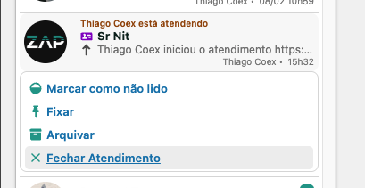
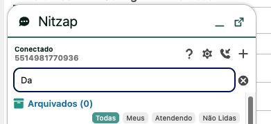

# 1.371

[Clique aqui para instalar o pacote](https://login.salesforce.com/packaging/installPackage.apexp?p0=04taj000000N7AT)

10, Fev 2026
## Correção de Contatos
   Alguns contatos vinham duplicados, para corrigir, force um Refresh

## Reumir conversa Ajuste
   Agora Resumir conversa pega 00:00 de sete dias pra trás

## Fechar atendimento por ação rápida no Omni

## Novo filtro para atendendos no Omni

## Metrics
   - Campos agora são ordenado por ordem alfabética
   - Agora quando é agregado por um campo ID, ele pega o Nome no Objeto relacionado Ex(OwnerId = Owner.Name)

## X para limpar busca 

## Bugs Atendimento Resolvido
   Corrigido um bug no atendimento que preenchia o agendamento ao preencher task
   Quando abria atendimento não mostrava em tempo que foi aberto

## Botão desconectar
   Corrigido botão desconectar que não aparece para todos os usuários
   

